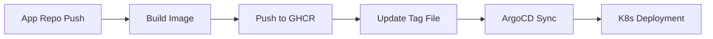

# Core Charts - GitOps Infrastructure Documentation

## 📋 Table of Contents
- [Overview](#overview)
- [Architecture](#architecture)
- [Repository Structure](#repository-structure)
- [Deployment Flow](#deployment-flow)
- [Adding New Applications](#adding-new-applications)
- [Environments](#environments)
- [CI/CD Integration](#cicd-integration)
- [Troubleshooting](#troubleshooting)
- [Server Access](#server-access)
- [Current Status & TODO](#current-status--todo)

## Overview

This repository implements a GitOps-based deployment strategy for Kubernetes applications using ArgoCD and Helm charts. It serves as the single source of truth for all application configurations deployed to our Kubernetes cluster.

### Key Components
- **ArgoCD**: Continuous delivery tool for Kubernetes
- **Helm Charts**: Package manager for Kubernetes applications
- **GitHub Actions**: CI/CD automation
- **Cert-Manager**: Automatic TLS certificate management
- **NGINX Ingress**: External traffic routing

## Architecture

```
┌─────────────────────────────────────────────────────────────┐
│                     GitHub Repository                        │
│                    (uz0/core-charts)                        │
└──────────────┬──────────────────────────────────────────────┘
               │
               │ Watches for changes
               ▼
┌─────────────────────────────────────────────────────────────┐
│                         ArgoCD                               │
│                  (Kubernetes Cluster)                        │
├─────────────────────────────────────────────────────────────┤
│  - Monitors GitHub repository                                │
│  - Syncs Helm charts to cluster                             │
│  - Manages application lifecycle                            │
└──────────────┬──────────────────────────────────────────────┘
               │
               │ Deploys
               ▼
┌─────────────────────────────────────────────────────────────┐
│                    Kubernetes Cluster                        │
│                   (46.62.223.198)                           │
├─────────────────────────────────────────────────────────────┤
│  Namespaces:                                                │
│  - dev-core (Development environment)                       │
│  - prod-core (Production environment)                       │
│  - argocd (ArgoCD system)                                   │
└─────────────────────────────────────────────────────────────┘
```

## Repository Structure

```
core-charts/
├── charts/                      # Helm charts directory
│   └── core-pipeline/           # Example application chart
│       ├── Chart.yaml           # Chart metadata
│       ├── values.yaml          # Default values
│       ├── values-dev.yaml      # Development overrides
│       ├── values-prod.yaml     # Production overrides
│       ├── dev.tag.yaml         # Development image tag (auto-updated by CI/CD)
│       ├── prod.tag.yaml        # Production image tag (auto-updated by CI/CD)
│       └── templates/           # Kubernetes manifests templates
│           ├── deployment.yaml
│           ├── service.yaml
│           ├── ingress.yaml
│           ├── configmap.yaml
│           ├── secret.yaml
│           ├── hpa.yaml         # Horizontal Pod Autoscaler
│           ├── pdb.yaml         # Pod Disruption Budget
│           └── _helpers.tpl     # Template helpers
├── argocd/
│   └── applications.yaml        # ArgoCD Application definitions
├── argocd/
│   └── applications.yaml        # ArgoCD Application definitions
└── .github/
    └── workflows/
        ├── update-image-tag.yaml   # Reusable workflow for CI/CD
        └── update-deployment.yaml  # Deployment trigger workflow
```

## Deployment Flow

### GitOps Workflow

1. **Application Repository** builds and pushes Docker image
2. **Application CI/CD** calls this repository's workflow to update image tag
3. **Tag files** (`charts/<app-name>/dev.tag.yaml` or `charts/<app-name>/prod.tag.yaml`) are updated
4. **ArgoCD** detects changes and syncs to Kubernetes
5. **Kubernetes** rolls out new deployment



## Adding New Applications

### Step 1: Create Helm Chart

Create a new directory under `charts/` with your application name:

```bash
mkdir -p charts/my-new-app
cd charts/my-new-app
```

### Step 2: Create Chart.yaml

```yaml
apiVersion: v2
name: my-new-app
description: A Helm chart for My New Application
type: application
version: 0.1.0
appVersion: "1.0.0"
```

### Step 3: Create Default values.yaml

```yaml
replicaCount: 1

image:
  repository: ghcr.io/uz0/my-new-app
  tag: "latest"
  pullPolicy: IfNotPresent

service:
  type: ClusterIP
  port: 80
  targetPort: 3000

ingress:
  enabled: true
  className: nginx
  annotations:
    cert-manager.io/cluster-issuer: letsencrypt-prod
  hosts:
    - host: my-app.example.com
      paths:
        - path: /
          pathType: Prefix
  tls:
    - secretName: my-app-tls
      hosts:
        - my-app.example.com

resources:
  limits:
    cpu: 500m
    memory: 512Mi
  requests:
    cpu: 100m
    memory: 128Mi

autoscaling:
  enabled: false
  minReplicas: 1
  maxReplicas: 5
  targetCPUUtilizationPercentage: 80

env: []
```

### Step 4: Create Environment-Specific Values

**values-dev.yaml:**
```yaml
replicaCount: 1

ingress:
  hosts:
    - host: my-app.dev.example.com
      paths:
        - path: /
          pathType: Prefix

env:
  - name: NODE_ENV
    value: development
  - name: LOG_LEVEL
    value: debug
```

**values-prod.yaml:**
```yaml
replicaCount: 2

autoscaling:
  enabled: true
  minReplicas: 2
  maxReplicas: 10

ingress:
  hosts:
    - host: my-app.example.com
      paths:
        - path: /
          pathType: Prefix

env:
  - name: NODE_ENV
    value: production
  - name: LOG_LEVEL
    value: info
```

### Step 5: Copy Templates

Copy templates from `charts/core-pipeline/templates/` and modify as needed.

### Step 6: Create Tag Files

Create these files in your chart directory:

**charts/my-new-app/dev.tag.yaml:**
```yaml
image:
  tag: "develop"
```

**charts/my-new-app/prod.tag.yaml:**
```yaml
image:
  tag: "v1.0.0"
```

### Step 7: Add ArgoCD Application

Add to `argocd/applications.yaml`:

```yaml
---
apiVersion: argoproj.io/v1alpha1
kind: Application
metadata:
  name: my-new-app-dev
  namespace: argocd
spec:
  project: default
  source:
    repoURL: https://github.com/uz0/core-charts
    targetRevision: main
    path: charts/my-new-app
    helm:
      valueFiles:
      - values.yaml
      - values-dev.yaml
      - dev.tag.yaml
  destination:
    server: https://kubernetes.default.svc
    namespace: dev-core
  syncPolicy:
    automated:
      prune: true
      selfHeal: true
    syncOptions:
    - CreateNamespace=true
---
apiVersion: argoproj.io/v1alpha1
kind: Application
metadata:
  name: my-new-app-prod
  namespace: argocd
spec:
  project: default
  source:
    repoURL: https://github.com/uz0/core-charts
    targetRevision: main
    path: charts/my-new-app
    helm:
      valueFiles:
      - values.yaml
      - values-prod.yaml
      - prod.tag.yaml
  destination:
    server: https://kubernetes.default.svc
    namespace: prod-core
  syncPolicy:
    automated:
      prune: true
      selfHeal: true
    syncOptions:
    - CreateNamespace=true
```

### Step 8: Configure Application CI/CD

In your application repository, add GitHub Actions workflow:

```yaml
name: Build and Deploy
on:
  push:
    branches: [main, develop]

jobs:
  build:
    runs-on: ubuntu-latest
    steps:
      - uses: actions/checkout@v4
      
      - name: Set up Docker Buildx
        uses: docker/setup-buildx-action@v3
      
      - name: Log in to GitHub Container Registry
        uses: docker/login-action@v3
        with:
          registry: ghcr.io
          username: ${{ github.actor }}
          password: ${{ secrets.GITHUB_TOKEN }}
      
      - name: Build and push Docker image
        uses: docker/build-push-action@v5
        with:
          context: .
          push: true
          tags: ghcr.io/${{ github.repository }}:${{ github.sha }}
      
      - name: Update image tag in core-charts
        uses: uz0/core-charts/.github/workflows/update-image-tag.yaml@main
        with:
          environment: ${{ github.ref == 'refs/heads/main' && 'prod' || 'dev' }}
          image_tag: ${{ github.sha }}
          app_name: my-new-app
        secrets:
          REPO_ACCESS_TOKEN: ${{ secrets.CHARTS_REPO_TOKEN }}
```

## Environments

### Development Environment
- **Namespace**: `dev-core`
- **Domain Pattern**: `*.dev.theedgestory.org`
- **Auto-sync**: Enabled
- **Branch**: Updates from `develop` branch pushes

### Production Environment
- **Namespace**: `prod-core`
- **Domain Pattern**: `*.theedgestory.org`
- **Auto-sync**: Enabled with approval
- **Branch**: Updates from `main` branch pushes

## CI/CD Integration

### Required Secrets

In your application repository, configure:

1. **CHARTS_REPO_TOKEN**: Personal Access Token with write access to `uz0/core-charts`

### Workflow Integration

The `update-image-tag.yaml` workflow in this repository is designed to be called by application repositories:

```yaml
on:
  workflow_call:
    inputs:
      environment:
        required: true
        type: string
      image_tag:
        required: true
        type: string
      app_name:
        required: true
        type: string
    secrets:
      REPO_ACCESS_TOKEN:
        required: true
```

## Troubleshooting

### ArgoCD Sync Issues

1. **Check ArgoCD Application Status**:
```bash
kubectl get applications -n argocd
kubectl describe application <app-name> -n argocd
```

2. **Check Repository Access**:
```bash
kubectl get secrets -n argocd | grep repo
kubectl describe secret repo-uz0-core-charts -n argocd
```

3. **Force Sync**:
```bash
kubectl patch application <app-name> -n argocd \
  --type merge -p '{"metadata":{"annotations":{"argocd.argoproj.io/refresh":"hard"}}}'
```

### Deployment Issues

1. **Check Pod Status**:
```bash
kubectl get pods -n <namespace>
kubectl describe pod <pod-name> -n <namespace>
kubectl logs <pod-name> -n <namespace>
```

2. **Check Ingress**:
```bash
kubectl get ingress -n <namespace>
kubectl describe ingress <ingress-name> -n <namespace>
```

3. **Check Services**:
```bash
kubectl get svc -n <namespace>
kubectl describe svc <service-name> -n <namespace>
```

## Server Access

### SSH Connection
```bash
ssh -i ~/.ssh/uz0 root@46.62.223.198
# Passphrase: 123454
```

### Quick Commands

**Check cluster status**:
```bash
kubectl get nodes
kubectl top nodes
kubectl get pods -A | grep -v Running
```

**Check ArgoCD**:
```bash
kubectl get applications -n argocd
kubectl get pods -n argocd
```

**Check deployments**:
```bash
kubectl get deployments -n dev-core
kubectl get deployments -n prod-core
```

**View logs**:
```bash
kubectl logs -f deployment/<app-name> -n <namespace>
```

## Current Status & TODO

### Current Infrastructure State
*Last checked: September 29, 2025*

#### ⚠️ Access Issues
- **SSH Access**: Failed - Invalid SSH key format issue prevents direct server access
- **kubectl Access**: Limited - Local context has insufficient RBAC permissions
- **Required Action**: Need to fix SSH key or get proper credentials from administrator

#### 🔴 Application Status
- **Development**: https://core-pipeline.dev.theedgestory.org/
  - Status: **404 Not Found**
  - Swagger: **404 Not Found** at `/swagger`
- **Production**: https://core-pipeline.theedgestory.org/
  - Status: **404 Not Found**
  - Swagger: **404 Not Found** at `/swagger`

### 🚨 Critical TODO List

#### Immediate Actions (Do First)
1. **[ ] Fix SSH Access**
   - Resolve SSH key format issue for `root@46.62.223.198`
   - Alternative: Get new SSH key or use password authentication
   - Command to test: `ssh -i ~/.ssh/uz0 root@46.62.223.198`

2. **[ ] Configure ArgoCD Repository Access**
   ```bash
   # On server, create repository secret with GitHub token
   kubectl create secret generic repo-uz0-core-charts \
     --from-literal=type=git \
     --from-literal=url=https://github.com/uz0/core-charts.git \
     --from-literal=username=not-used \
     --from-literal=password=<GITHUB_PERSONAL_ACCESS_TOKEN> \
     -n argocd --dry-run=client -o yaml | kubectl apply -f -
   ```

3. **[ ] Apply ArgoCD Applications**
   ```bash
   # On server, apply ArgoCD applications
   kubectl apply -f https://raw.githubusercontent.com/uz0/core-charts/main/argocd/applications.yaml
   ```

#### Deployment Actions
4. **[ ] Deploy Applications Manually (if ArgoCD fails)**
   ```bash
   # Direct deployment as fallback
   kubectl apply -f https://raw.githubusercontent.com/uz0/core-charts/deploy-core-pipeline/deploy.yaml
   ```

5. **[ ] Verify Deployments**
   ```bash
   kubectl get pods -n dev-core
   kubectl get pods -n prod-core
   kubectl get ingress -A | grep core
   ```

6. **[ ] Check ArgoCD Sync Status**
   ```bash
   kubectl get applications -n argocd
   kubectl describe application core-pipeline-dev -n argocd
   kubectl describe application core-pipeline-prod -n argocd
   ```

#### Configuration Actions
7. **[ ] Update Image Repositories**
   - Current placeholder: `swaggerapi/petstore3:unstable`
   - Need actual application image from `ghcr.io/uz0/core-pipeline`

8. **[ ] Configure CI/CD Pipeline**
   - Set up GitHub Actions in `core-pipeline` repository
   - Add `CHARTS_REPO_TOKEN` secret with write access to `uz0/core-charts`

9. **[ ] Fix Ingress Configuration**
   ```bash
   # Check ingress controller
   kubectl get pods -n ingress-nginx
   kubectl get ingress -A
   ```

10. **[ ] Verify DNS Resolution**
    ```bash
    nslookup core-pipeline.dev.theedgestory.org
    nslookup core-pipeline.theedgestory.org
    ```

#### Long-term Actions
11. **[ ] Set up Monitoring**
    - Configure Prometheus/Grafana for metrics
    - Set up alerting rules

12. **[ ] Configure Backup Strategy**
    - Set up regular backups of persistent data
    - Document recovery procedures

13. **[ ] Security Hardening**
    - Implement NetworkPolicies
    - Set up PodSecurityPolicies
    - Regular security scanning

### 📝 Commands to Run on Server

Once SSH access is restored, execute these commands in order:

```bash
#!/bin/bash

# 1. Check cluster health
kubectl get nodes
kubectl top nodes

# 2. Check ArgoCD
kubectl get pods -n argocd
kubectl get applications -n argocd

# 3. Add repository secret (replace YOUR_GITHUB_TOKEN)
kubectl create secret generic repo-uz0-core-charts \
  --from-literal=type=git \
  --from-literal=url=https://github.com/uz0/core-charts.git \
  --from-literal=username=not-used \
  --from-literal=password=YOUR_GITHUB_TOKEN \
  -n argocd --dry-run=client -o yaml | kubectl apply -f -

# 4. Apply ArgoCD applications
kubectl apply -f https://raw.githubusercontent.com/uz0/core-charts/main/argocd/applications.yaml

# 5. Force sync
kubectl patch application core-pipeline-dev -n argocd \
  --type merge -p '{"metadata":{"annotations":{"argocd.argoproj.io/refresh":"hard"}}}'
kubectl patch application core-pipeline-prod -n argocd \
  --type merge -p '{"metadata":{"annotations":{"argocd.argoproj.io/refresh":"hard"}}}'

# 6. Check deployment status
kubectl get all -n dev-core
kubectl get all -n prod-core

# 7. Check logs if pods are failing
kubectl logs -n dev-core -l app.kubernetes.io/name=core-pipeline
kubectl logs -n prod-core -l app.kubernetes.io/name=core-pipeline

# 8. Verify ingress
kubectl get ingress -A
kubectl describe ingress core-pipeline -n dev-core
kubectl describe ingress core-pipeline -n prod-core
```

### 🔧 Troubleshooting Guide

**If applications still show 404:**
1. Check if pods are running: `kubectl get pods -n dev-core`
2. Check service endpoints: `kubectl get endpoints -n dev-core`
3. Check ingress controller: `kubectl get pods -n ingress-nginx`
4. Verify certificate: `kubectl get certificate -n dev-core`

**If ArgoCD can't sync:**
1. Check repository access: `kubectl logs -n argocd deployment/argocd-repo-server`
2. Check application status: `kubectl describe application core-pipeline-dev -n argocd`
3. Manual sync: `argocd app sync core-pipeline-dev`

**If pods are crashing:**
1. Check logs: `kubectl logs <pod-name> -n <namespace>`
2. Describe pod: `kubectl describe pod <pod-name> -n <namespace>`
3. Check resources: `kubectl top pods -n <namespace>`

---

## Quick Start Commands

### Deploy Everything
```bash
# On the server
kubectl apply -f https://raw.githubusercontent.com/uz0/core-charts/main/argocd/applications.yaml
```

### Check Status
```bash
./verify-deployment.sh
```

### Update Image Tag (from app repo)
```bash
curl -X POST \
  -H "Accept: application/vnd.github.v3+json" \
  -H "Authorization: token $GITHUB_TOKEN" \
  https://api.github.com/repos/uz0/core-charts/dispatches \
  -d '{"event_type":"update-image","client_payload":{"environment":"dev","tag":"v1.2.3","app":"my-app"}}'
```

---

*Last Updated: September 2025*
*Maintained by: DevOps Team*