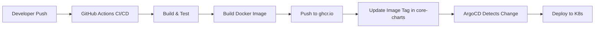

# Ultimate Deployment Flow for Core-Pipeline

## Overview


## Architecture

### 1. Source Repository: `uz0/core-pipeline`
- Contains application source code
- Has CI/CD pipeline (GitHub Actions)
- Builds and pushes Docker images

### 2. GitOps Repository: `uz0/core-charts`
- Contains Kubernetes manifests
- Tracked by ArgoCD
- Image tags updated automatically

### 3. ArgoCD
- Watches `core-charts` repository
- Auto-syncs changes to Kubernetes
- Manages dev and prod environments

## Implementation

### Step 1: GitHub Actions Workflow for core-pipeline repo
Create `.github/workflows/deploy.yaml` in `uz0/core-pipeline`:

```yaml
name: Build and Deploy

on:
  push:
    branches: [main, develop]
  pull_request:
    branches: [main]

env:
  REGISTRY: ghcr.io
  IMAGE_NAME: ${{ github.repository }}

jobs:
  build:
    runs-on: ubuntu-latest
    permissions:
      contents: read
      packages: write
    
    outputs:
      image-tag: ${{ steps.meta.outputs.tags }}
      image-digest: ${{ steps.build.outputs.digest }}
    
    steps:
      - name: Checkout code
        uses: actions/checkout@v4
      
      - name: Setup Node.js
        uses: actions/setup-node@v4
        with:
          node-version: '20'
      
      - name: Install dependencies
        run: npm ci
      
      - name: Run tests
        run: npm test
      
      - name: Log in to Container Registry
        uses: docker/login-action@v3
        with:
          registry: ${{ env.REGISTRY }}
          username: ${{ github.actor }}
          password: ${{ secrets.GITHUB_TOKEN }}
      
      - name: Extract metadata
        id: meta
        uses: docker/metadata-action@v5
        with:
          images: ${{ env.REGISTRY }}/${{ env.IMAGE_NAME }}
          tags: |
            type=ref,event=branch
            type=ref,event=pr
            type=semver,pattern={{version}}
            type=sha,prefix={{branch}}-
      
      - name: Build and push Docker image
        id: build
        uses: docker/build-push-action@v5
        with:
          context: .
          push: true
          tags: ${{ steps.meta.outputs.tags }}
          labels: ${{ steps.meta.outputs.labels }}
  
  update-manifests:
    needs: build
    if: github.ref == 'refs/heads/main' || github.ref == 'refs/heads/develop'
    runs-on: ubuntu-latest
    
    steps:
      - name: Checkout core-charts
        uses: actions/checkout@v4
        with:
          repository: uz0/core-charts
          token: ${{ secrets.CHARTS_GITHUB_TOKEN }}
          path: core-charts
      
      - name: Update image tag
        run: |
          cd core-charts
          
          # Determine environment
          if [[ "${{ github.ref }}" == "refs/heads/main" ]]; then
            ENV="prod"
            FILE="manifests/prod-core-pipeline.yaml"
          else
            ENV="dev"
            FILE="manifests/dev-core-pipeline.yaml"
          fi
          
          # Update image tag
          IMAGE_TAG="${{ needs.build.outputs.image-tag }}"
          sed -i "s|image: .*|image: ${IMAGE_TAG}|g" $FILE
          
          # Commit and push
          git config user.name "GitHub Actions"
          git config user.email "actions@github.com"
          git add .
          git commit -m "Update ${ENV} image to ${IMAGE_TAG}"
          git push
```

### Step 2: Dockerfile for core-pipeline
Create `Dockerfile` in `uz0/core-pipeline`:

```dockerfile
# Build stage
FROM node:20-alpine AS builder
WORKDIR /app
COPY package*.json ./
RUN npm ci --only=production

# Runtime stage
FROM node:20-alpine
WORKDIR /app
RUN apk add --no-cache tini
COPY --from=builder /app/node_modules ./node_modules
COPY . .
EXPOSE 3000
USER node
ENTRYPOINT ["/sbin/tini", "--"]
CMD ["node", "server.js"]
```

### Step 3: Update Kubernetes Manifests
Update manifests to use proper image tags:

#### manifests/dev-core-pipeline.yaml
```yaml
apiVersion: apps/v1
kind: Deployment
metadata:
  name: core-pipeline
  namespace: dev-core
spec:
  replicas: 1
  selector:
    matchLabels:
      app: core-pipeline
  template:
    metadata:
      labels:
        app: core-pipeline
        version: develop
    spec:
      containers:
      - name: core-pipeline
        image: ghcr.io/uz0/core-pipeline:develop
        imagePullPolicy: Always
        # ... rest of config
```

#### manifests/prod-core-pipeline.yaml
```yaml
apiVersion: apps/v1
kind: Deployment
metadata:
  name: core-pipeline
  namespace: prod-core
spec:
  replicas: 3
  selector:
    matchLabels:
      app: core-pipeline
  template:
    metadata:
      labels:
        app: core-pipeline
        version: main
    spec:
      containers:
      - name: core-pipeline
        image: ghcr.io/uz0/core-pipeline:main
        imagePullPolicy: IfNotPresent
        # ... rest of config
```

### Step 4: ArgoCD Applications
Create ArgoCD applications that watch the manifests:

```yaml
apiVersion: argoproj.io/v1alpha1
kind: Application
metadata:
  name: core-pipeline-dev
  namespace: argocd
spec:
  project: default
  source:
    repoURL: https://github.com/uz0/core-charts
    targetRevision: main
    path: manifests
    directory:
      include: 'dev-*.yaml'
  destination:
    server: https://kubernetes.default.svc
    namespace: dev-core
  syncPolicy:
    automated:
      prune: true
      selfHeal: true
    syncOptions:
    - CreateNamespace=true
---
apiVersion: argoproj.io/v1alpha1
kind: Application
metadata:
  name: core-pipeline-prod
  namespace: argocd
spec:
  project: default
  source:
    repoURL: https://github.com/uz0/core-charts
    targetRevision: main
    path: manifests
    directory:
      include: 'prod-*.yaml'
  destination:
    server: https://kubernetes.default.svc
    namespace: prod-core
  syncPolicy:
    automated:
      prune: true
      selfHeal: true
    syncOptions:
    - CreateNamespace=true
```

### Step 5: Setup Secrets

1. **GitHub Token for CI/CD**
   - Create token at: https://github.com/settings/tokens
   - Add to core-pipeline repo secrets as `CHARTS_GITHUB_TOKEN`
   - Needs `repo` scope to push to core-charts

2. **Image Pull Secret for Kubernetes**
   ```bash
   kubectl create secret docker-registry ghcr-secret \
     --docker-server=ghcr.io \
     --docker-username=uz0 \
     --docker-password=YOUR_GITHUB_TOKEN \
     -n dev-core
   
   kubectl create secret docker-registry ghcr-secret \
     --docker-server=ghcr.io \
     --docker-username=uz0 \
     --docker-password=YOUR_GITHUB_TOKEN \
     -n prod-core
   ```

3. **ArgoCD Repository Access**
   ```bash
   kubectl create secret generic repo-core-charts \
     -n argocd \
     --from-literal=type=git \
     --from-literal=url=https://github.com/uz0/core-charts \
     --from-literal=username=uz0 \
     --from-literal=password=YOUR_GITHUB_TOKEN
   
   kubectl label secret repo-core-charts -n argocd \
     argocd.argoproj.io/secret-type=repository
   ```

## Deployment Flow

### Development Workflow
1. Developer pushes to `develop` branch in `core-pipeline`
2. GitHub Actions builds and tests
3. Docker image built and pushed as `ghcr.io/uz0/core-pipeline:develop`
4. GitHub Actions updates `dev-core-pipeline.yaml` in `core-charts`
5. ArgoCD detects change and deploys to `dev-core` namespace

### Production Workflow
1. Developer merges to `main` branch in `core-pipeline`
2. GitHub Actions builds and tests
3. Docker image built and pushed as `ghcr.io/uz0/core-pipeline:main`
4. GitHub Actions updates `prod-core-pipeline.yaml` in `core-charts`
5. ArgoCD detects change and deploys to `prod-core` namespace

## Advanced Features

### 1. Automated Image Updates with Renovate
Add `.github/renovate.json` to `core-charts`:
```json
{
  "extends": ["config:base"],
  "regexManagers": [
    {
      "fileMatch": ["^manifests/.*\\.yaml$"],
      "matchStrings": [
        "image:\\s+(?<depName>.*?):(?<currentValue>.*?)\\s"
      ],
      "datasourceTemplate": "docker"
    }
  ]
}
```

### 2. Promotion Between Environments
```yaml
name: Promote to Production
on:
  workflow_dispatch:
    inputs:
      version:
        description: 'Version to promote'
        required: true

jobs:
  promote:
    runs-on: ubuntu-latest
    steps:
      - uses: actions/checkout@v4
        with:
          repository: uz0/core-charts
          token: ${{ secrets.CHARTS_GITHUB_TOKEN }}
      
      - name: Update production manifest
        run: |
          sed -i "s|image: .*|image: ghcr.io/uz0/core-pipeline:${{ inputs.version }}|g" \
            manifests/prod-core-pipeline.yaml
          
          git config user.name "GitHub Actions"
          git config user.email "actions@github.com"
          git add .
          git commit -m "Promote ${{ inputs.version }} to production"
          git push
```

### 3. Rollback Strategy
```bash
# Via ArgoCD UI
# 1. Go to application
# 2. Click "History and Rollback"
# 3. Select previous version
# 4. Click "Rollback"

# Via CLI
argocd app rollback core-pipeline-prod --revision 2
```

## Monitoring

### 1. ArgoCD Notifications
```yaml
apiVersion: v1
kind: ConfigMap
metadata:
  name: argocd-notifications-cm
  namespace: argocd
data:
  service.webhook.slack: |
    url: https://hooks.slack.com/services/YOUR/SLACK/WEBHOOK
  template.app-deployed: |
    webhook:
      slack:
        method: POST
        body: |
          {
            "text": "Application {{.app.metadata.name}} deployed successfully"
          }
```

### 2. Health Checks
Add to deployment:
```yaml
livenessProbe:
  httpGet:
    path: /health
    port: 3000
  initialDelaySeconds: 30
  periodSeconds: 10
readinessProbe:
  httpGet:
    path: /ready
    port: 3000
  initialDelaySeconds: 10
  periodSeconds: 5
```

## Commands Summary

```bash
# Check deployment status
kubectl get applications -n argocd

# Force sync
argocd app sync core-pipeline-dev

# Check pods
kubectl get pods -n dev-core
kubectl get pods -n prod-core

# View logs
kubectl logs -n dev-core -l app=core-pipeline -f

# Scale deployment
kubectl scale deployment core-pipeline -n prod-core --replicas=5

# Rollback
argocd app rollback core-pipeline-prod --revision 2
```